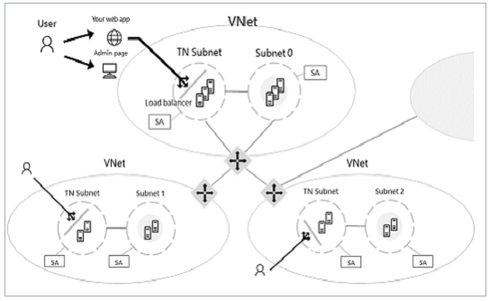

<h3>UNBlockchain</h3>

Este proyecto ha sido desarrollado para presentar conceptos básicos sobre Blockchain de forma práctica y útil, para los estudiantes de Ciberseguridad de la Universidad Nacional de Colombia, y todo aquel que quiera aprender sobre esta tecnología que está revolucionando la Internet y la economía a nivel mundial.

Este proyecto cuenta con tres partes principalmente:

* Consoncio privado basado en Ethereum, sobre Azure
* Web API
* Aplicación Móvil

<h4>Proof Of Work (PoW)</h4>

Proof Of Work o Prueba de Trabajo es un algoritmo de consenso entre nodos en una cadena de bloques. Principalmente, es usado para confirmar transacciones y producir nuevos bloques que se agregarán a la cadena. Por otro lado, los mineros, compiten entre ellos para completar una transacción (y obtener una recompensa por ello), es decir, son quienes realizan todo el trabajo computacional para generar los <i>hash</i>, necesarios para realizar la transacción.

Los principales beneficios de este tipo de consenso es la defensa contra ataques de denegación de servicio (DoS) y la capacidad computacional requerida para adueñarse de la red. Sin embargo, tiene algunas desventajas con respecto a otros algoritmos; los cuales son, la cantidad de recursos energéticos necesarios para generar los <i>hash</i> y que todo el cálculo computacional realizado por todos los mineros es desperdiciada (no es posible reutilizar)

Finalmente, se han presentado otros algoritmos de consenso diferentes a PoW, el cual fue la base de Blockchain inicialmente y todas las criptomonedas basadas en esta red distribuida; como los son: Proof of Stake (PoS) y Proof of Authority (PoA), este último, planteado por el ex-CTO de Ethereum y que se basa principalmente en cadenas de bloques privadas.

<h4>Consoncio privado basado en Ethereum, sobre Azure</h4>

Microsoft ofrece diferentes plantillas con el fin de facilitar la implementación y configuración de una red Blockchain basada en consorcios de Ethereum.

Por lo tanto, se realiza la implementación de una cadena de bloques basada en Ethereum, y que tiene su fundamento en PoW. Adicionalmente, cada miembro puede aprovisionar su huella de red, utilizando los servicios de computación, redes y almacenamiento de Microsoft Azure en todo el mundo. La huella de la red de cada miembro consiste en un conjunto de nodos de transacciones con carga equilibrada con los que una aplicación o usuario puede interactuar para enviar transacciones, un conjunto de nodos de extracción para registrar transacciones y una puerta de enlace VPN. Un paso de conexión posterior conecta las puertas de enlace para crear una red de blockchain de múltiples miembros completamente configurada.

### Arquitectura del Consorcio

<h4>Web API</h4>
El API fue desarrollada usando .NET Core y es quien se conecta al consorcio y brinda los servicios a la aplicación móvil. 
La conexión con la red blockchain se hizo a través del uso de la librería Nethereum, la cual provee una serie de funciones que fueron desarrolladas para Ethereum y se han generalizado para diferentes lenguajes.

La aplicación cuenta con tres métodos básicos:

<b>/GetAccountBalance:</b> El cual obtiene el saldo disponible para una cuenta, dada la dirección.

<b>/AddAccount:</b> Crea una cuenta de usuario a través de una llave privada que se retorna al crear la cuenta.

<b>/Transfer:</b> Realiza una transacción. Recibe como parámetros la llave privada del usuario que va a realizar la transacción, la dirección de quien recibe y el monto. Al momento de realizar la transacción retorna el <i>hash</i> de esta.

<h4>Aplicación Móvil</h4>

Es una aplicación desarrollada con Xamarin Forms para dispositivos móviles con SO Android. La aplicación cuenta con una vista inicial, donde el usuario deberá proporcionar su nombre, dirección y su llave privada para iniciar sesión. Cuenta con una vista donde el usuario podrá consultar su saldo, una en la que podrá realizar trasacciones y una última donde podrá ver este repositorio.

<b>NOTA</b>
El objetivo de este proyecto es dar a conocer conceptos de Blockchain a nivel académico de forma práctica, por lo tanto, tome las medidas de seguridad necesarias al momento de realizar una implementación que no tenga un objetivo académico.

Happy coding!
